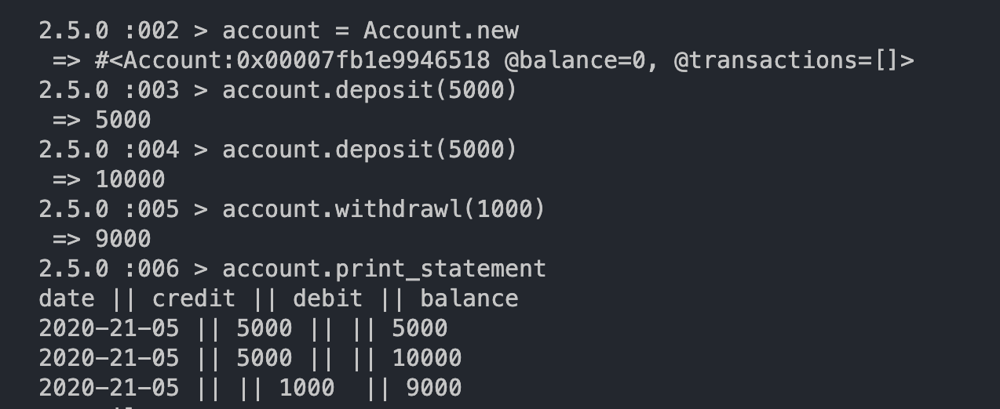
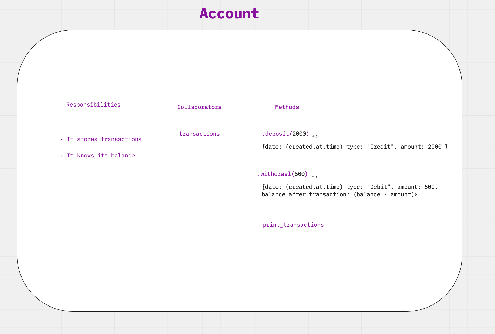
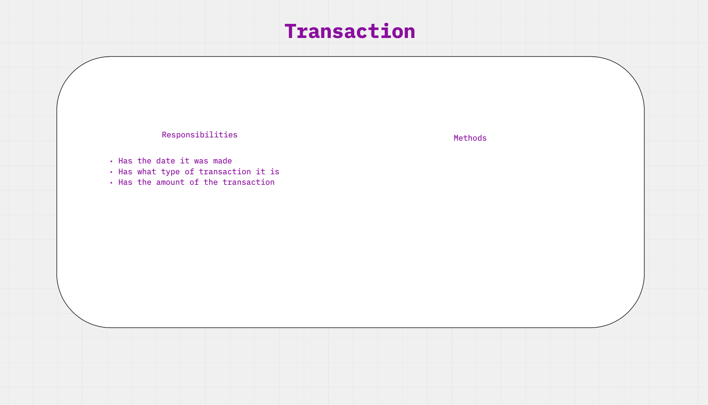

# Bank_tech_task
Practicing my T.D.D processes on an example tech task and showcasing my understanding of O.O.D.

---

**Specification**

Requirements

You should be able to interact with your code via a REPL like IRB or the JavaScript console. (You don't need to implement a command line interface that takes input from STDIN.)
Deposits, withdrawal.
Account statement (date, amount, balance) printing.
Data can be kept in memory (it doesn't need to be stored to a database or anything).
Acceptance criteria

Given a client makes a deposit of 1000 on 10-01-2012
And a deposit of 2000 on 13-01-2012
And a withdrawal of 500 on 14-01-2012
When she prints her bank statement
Then she would see


date || credit || debit || balance \
14/01/2012 || || 500.00 || 2500.00 \
13/01/2012 || 2000.00 || || 3000.00 \
10/01/2012 || 1000.00 || || 1000.00

## Coded with care by
- [Graham Falconer](https://github.com/grahamfalconer)

----

## Technologies

| Purpose       | Technology     | 
| ------------- |:-------------: | 
| Language      | Ruby 2.5.0     | 
| Test framework| Rspec          |
| Codequality   | Rubocop        |
| Codecoverage  | Simplecov      |

---

## Running the project
Clone the project

```bash
> bundle install
> irb
> require account

make a new account
> account.withdrawl(amount) or account.deposit(amount) to make some transactions
>account.print_statement to see your statement

```



---
  
## How to run tests  
- rspec 
  - run `rspec`
- simplecov 
  - connected to rspec
- rubocop 
  - run `rubocop`
---

## Planning and structure
I first decided to break the classes I was going to need down from the requirements, I knew I wanted the bulk of my interaction to happen through the account for ease of user access. I first created the account, then moved on to create transactions, and later statements...




